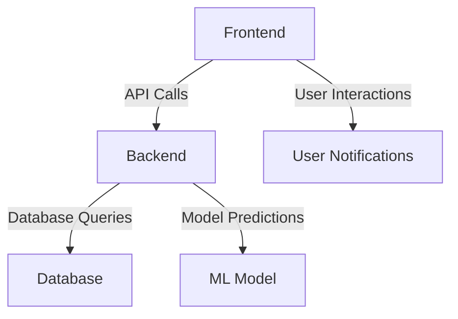

# AI-driven Financial Market Predictor

## Specification
This project implements an AI-driven financial market predictor that utilizes machine learning algorithms to analyze historical market data and generate predictions based on real-time inputs.

## Architecture Diagram


## Setup Instructions
1. Clone the repository:
   ```bash
   git clone https://github.com/yourusername/financial-market-predictor.git
   cd financial-market-predictor
   ```
2. Build and run the application using Docker Compose:
   ```bash
   docker-compose up --build
   ```
3. Access the frontend at `http://localhost:8501`.

## Running Tests
To run tests for the backend:
```bash
cd backend
pytest
```

To run tests for the frontend:
```bash
cd frontend
npm test
```

## Key Features
- **Real-time Market Trends**: View live updates on stock prices.
- **User-specific Predictions**: Customize predictions based on selected stocks.
- **Interactive Charts**: Visualize data trends over selected timeframes.
- **Notifications**: Receive alerts and insights based on predictive analytics.

## Example API Calls
### Get Historical Prices
```bash
curl -X GET http://localhost:8000/api/prices/{ticker}
```
### Get Predictions
```bash
curl -X GET http://localhost:8000/api/predictions/{ticker}
```
